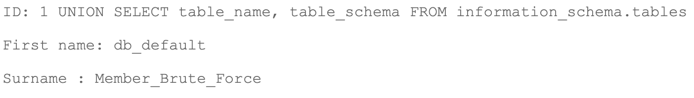
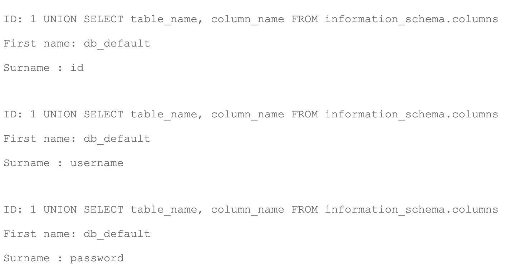
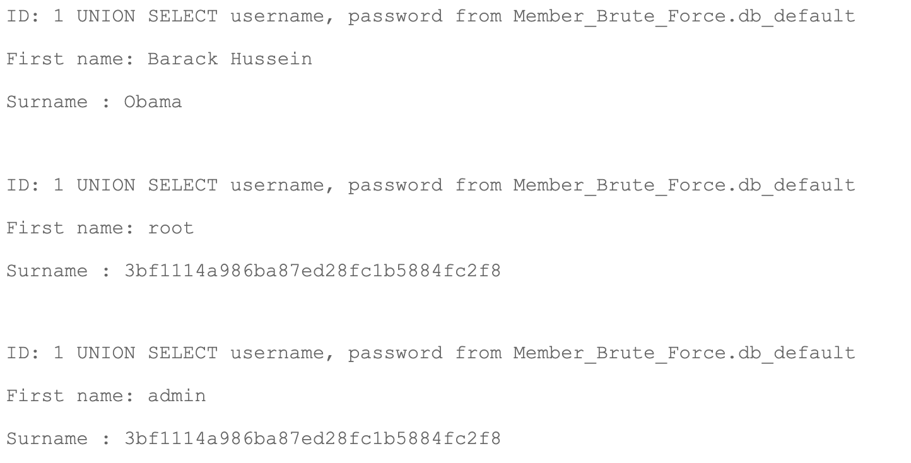

<h1 align="center">
db_default
</h1>
<p><b> La base de donnée : </b></p>

Sur la page Member, nous pouvons voir un champs qui permet de récupérer le nom et prénom d'un membre en entrant son id.  
En testant un peu (`1 or true`) on peux se rendre compte que la requête est mal faite (surement une requête pas prepare).  
Nous allons donc récupérer les informations de la base de donnée avec `information_schema`.  
Etant donné que nous avons une requête de base qui récupérer 2 informations depuis la base de donnée, nous somme limite à ce même nombre pour nos requêtes, dans le cas contraire nous avons une erreur, exemple :
```
1 UNION SELECT * FROM information_schema.tables
==> 
The used SELECT statements have a different number of columns
```

Nous allons d'abord récupérer les noms des tables ainsi que les types : 
```
1 UNION SELECT table_name, table_type FROM information_schema.tables
```
Nous pouvons constater qu'il y a 5 tables de type "BASE" : `db_default`, `users`, `guestbook`, `list_images`, `vote_dbs`.

<p><b> La base db_default :</b></p>

Nous soupconnons la base `db_default` d'être la premiere base créé avec un/des utilisateur(s) pour gerer le site. Un/des utilisateur(s) ayant les droits d'administrateur.  
Récuperons d'abord le nom de la base de donnée à laquelle appartient la table `db_default`:


La table `db_default` appartient donc à la base `Member_Brute_Force`.  
Nous allons ensuite récupérer les noms de colones de la table `db_default` afin de pouvoir faire nos requête suivantes :


La table à donc 3 colones, `id`, `username` et `password`.

<p><b> Récuperation du flag :</b></p>


Nous pouvons voir qu'il y a un user root et un user admin ayant la même valeur en password.
`3bf1114a986ba87ed28fc1b5884fc2f8` est le cryptage MD5 de `shadow`.  
Il nous reste donc à nous connecter avec le username `admin` ou `root` et le mot de passe `shadow` pour obtenir le flag.
