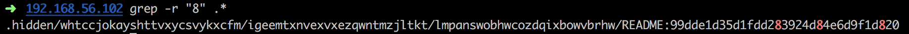

<h1 align="center">
db_default
</h1>

<p><b> Acceder a la base de donnee : </b></p>

Sur la page Member, nous pouvons voir un champs qui permet de recuperer le nom et prenom d'un membre en entrant son id.
En testant un peu (`1 or true`) on peux se rendre compte que la requete est mal faite (surement une requete pas prepare).
Nous allons donc recuperer les informations de la base de donnee avec information_schema.
Etant donne que nous avons une requete de base qui recupere 2 informations depuis la base de donnee, nous somme limite a ce meme nombre pour nos requetes, dans le cas contraire nous avons une erreur, exemple :
```

The used SELECT statements have a different number of columns
```

<p><b> Récupérer le dossier en local :</b></p>

Nous allons récupérer le dossier en local afin d'avoir un accès plus rapide et simple au dossiers et fichiers enfants à .hidden:  
```wget -r -np -e robots=off -R "index.html*" http://<IP>/.hidden/```  
`-r` : recursive  
`-np` : permet de ne pas remonter dans les repertoires parents  
`-e` : Exécute commande comme si elle faisait partie de .wgetrc  
`-R` : spécifie la liste des suffixes ou modèles de noms de fichiers qui doivent être acceptés ou rejetés   

Un dossier au nom de l'IP est créé et contient le dossier .hidden ainsi que les dossiers et fichiers enfants de celui-ci.  

<p><b> Recuperation du flag :</b></p>

Nous avons constaté que tout les dossiers contenaient un dossiers fils ou un fichier `README`.  
Ces fichiers ont une phrases chacune nous indiquants que nous étions tombé sur le mauvais :  
  
```Demande à ton voisin de gauche```  
```Demande à ton voisin de droite  ```  
```Tu veux de l'aide ? Moi aussi !```  
```Non ce n'est toujours pas bon ...```  
  
Et d'autre...    
Nous avons donc pense que l'un des fichiers readme contenais le flag a trouver.  
Nous avons donc fait la recherche d'un fichier contenant un chiffre (ici le 8) :   


<p><b> Solution : </b></p>
Ne pas rendre ce genre de fichiers publique serait un bon début.</br>
Utiliser un .htaccess est préférable.
