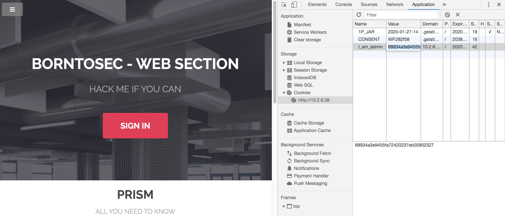

# Faille sur les Cookies

Pour trouver cette faille, on a ouvert les outils de développement pour voir les Cookies stockés et on a vu un Cookie I_am_admin avec une valeur qui ressemblait beaucoup à un hash MD5.
On a décrypté le hash est la valeur correspondait a false, du coup, on a crypté en md5 true et on a remplacé la valeur du Cookie.
Si on rafraichi la page on obtient le flag.



## Éviter cette faille

Pour résoudre cette faille il faut au moins bien crypter la valeur des cookies et éviter d'enregistrer des informations trop importantes.
Pour vérifier si l'utilisateur est admin on peut configurer sur le serveur l'utilisation des cookies pour stocker sur le navigateur une valeur cryptée, avec une date d'expiration, de façon à que seulement le serveur puisse la décrypter.
On peut aussi utiliser la session en `php`, de cette façon toute l'information sera stocké sur le serveur et sur le navigateur il y aura un cookie `PHPSESSID` avec un identifiant de la session.

### Exemple

```php
<?php
session_start(); // On démarre la session AVANT toute chose
?>
 
<!DOCTYPE html>
<html>
    <head>
        <meta charset="utf-8" />
        <title>Titre de ma page</title>
    </head>
    <body>
    <p>Re-bonjour !</p>
    <p>
        Je me souviens de toi ! Tu t'appelles <?php echo $_SESSION['prenom'] . ' ' . $_SESSION['nom']; ?> !<br />
        Et ton âge hummm... Tu as <?php echo $_SESSION['age']; ?> ans, c'est ça ? :-D
    </p>
    </body>
</html>
```