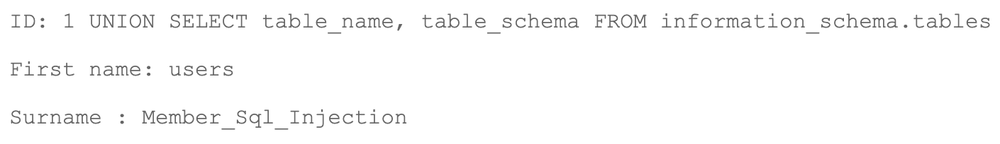
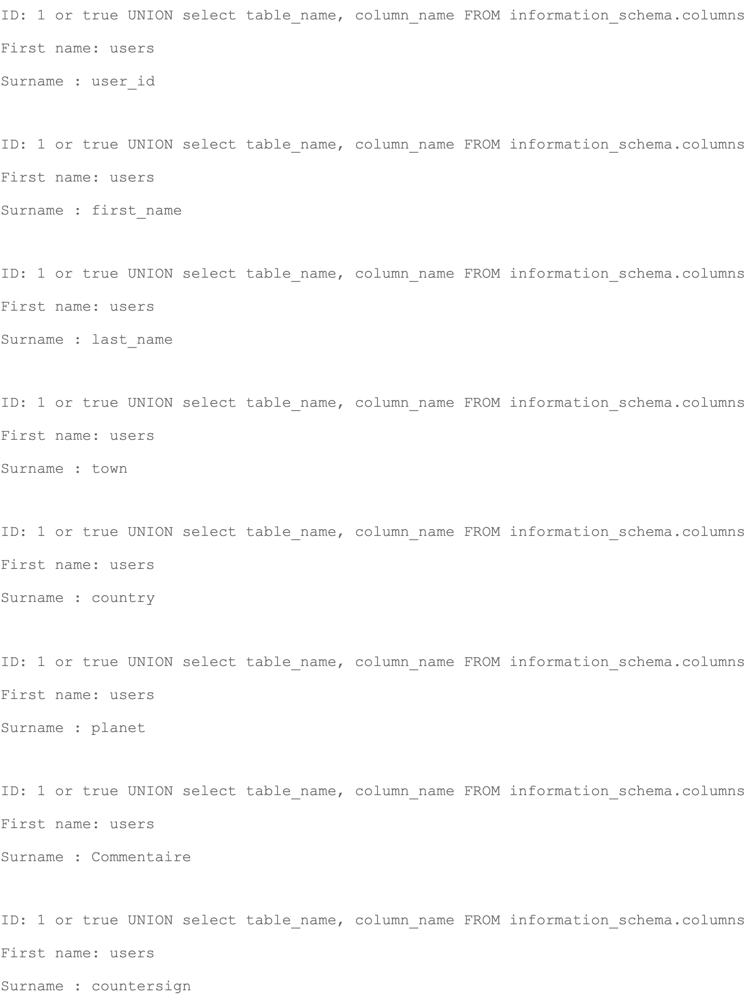
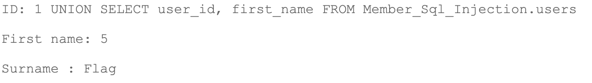
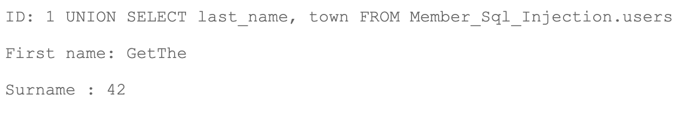
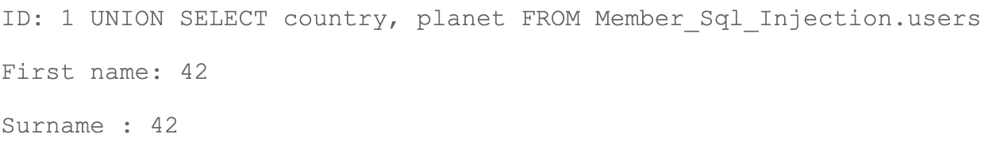
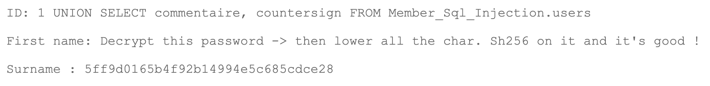

<h1 align="center">
users
</h1>
<p><b> La base de donnée : </b></p>

Sur la page Member, nous pouvons voir un champs qui permet de récupérer le nom et prénom d'un membre en entrant son id.  
En testant un peu (`1 or true`) on peux se rendre compte que la requête est mal faite (surement une requête pas prepare).  
Nous allons donc récupérer les informations de la base de donnée avec `information_schema`.  
Etant donné que nous avons une requête de base qui récupérer 2 informations depuis la base de donnée, nous somme limite à ce même nombre pour nos requêtes, dans le cas contraire nous avons une erreur, exemple :
```
1 UNION SELECT * FROM information_schema.tables
==> 
The used SELECT statements have a different number of columns
```

Nous allons d'abord récupérer les noms des tables ainsi que les types : 
```
1 UNION SELECT table_name, table_type FROM information_schema.tables
```
Nous pouvons constater qu'il y a 5 tables de type "BASE" : `db_default`, `users`, `guestbook`, `list_images`, `vote_dbs`.

<p><b> La base users :</b></p>

nous allons fouiller la base `users` afin d'y extraire des informations a notre avantage.
Récuperons d'abord le nom de la base de donnée à laquelle appartient la table `users`:


La table `users` appartient donc à la base `Member_Sql_Injection`.  
Nous allons ensuite récupérer les noms de colones de la table `users` afin de pouvoir faire nos requête suivantes :


La table à donc 5 colones: ```user_id, first_name, last_name, town, country, planet, Commentaire et countersign``` 

<p><b> Récuperation du flag :</b></p>
Nous allons nous interesser a un utilisateur en particulier:  

id 5 et nom `Flag`... Curieux non ?


nom `GetThe` town 42...


country et planet aussi sont 42


hmmm, bien plus interessant un commentaire qui dit de decrypter le mot de passe, et de l'encrypter en sha256 apres avoir mis toutes lettres en minuscules.

`5ff9d0165b4f92b14994e5c685cdce28` decrypte done `FortyTwo`.
sha256 de `fortytwo` nous donne le flag `10a16d834f9b1e4068b25c4c46fe0284e99e44dceaf08098fc83925ba6310ff5`

<p><b> Solutions : </b></p>
Proteger les requetes sql en les préparant.
