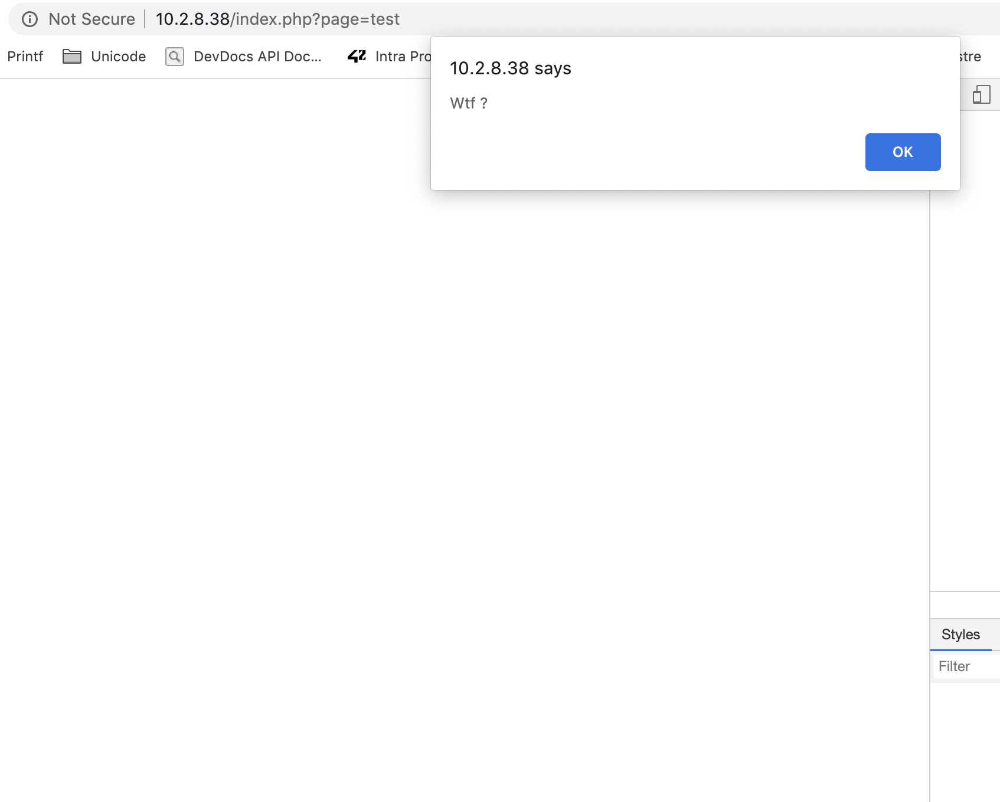

# Faille include

Comme son nom l'indique, elle exploite une mauvaise utilisation de la fonction `include()` qui permet d'inclure une page dans une autre.

```php
<?php
include("page.php");
?>
```

Cette fonction est très souvent utilisée pour exécuter du code PHP se situant dans une autre page, et particulièrement pour la connexion à une base de données.
Cette faille pourrait être exploitée soit à distance, si on peut inclure du contenu d'un serveur différent au site, ou en local si on peut récupérer des informations du site.

## Le flag

Quand on a visité les différentes page du site, on a vu sur l'URL que le site utilisait possiblement la fonction include.

```
http://10.2.8.38/index.php?page=survey
```

On voit aussi un message d'alerte quand on écrit une page qui n'existe pas.



On à écrit sur l'URL le chemin relatif pour nous déplacer sur les différents dossiers du site et arriver sur le fichier `passwd` de linux.
On met plusieurs `../` pour être sûr d'arriver à la racine.

```
http://10.2.8.38/index.php?page=../../../../../../../etc/passwd
```

## Comment se protéger

Pour corriger cette faille, le mieux est de vérifier que les pages que l'on inclut sont bien sur notre serveur, avec `file_exists()` ou d'avoir un tableau avec les pages autorisées.
Un autre moyen est d'utiliser un fichier `htaccess` pour faire des redirections.