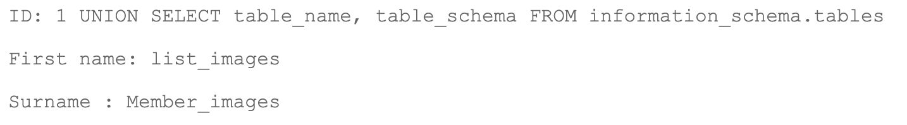
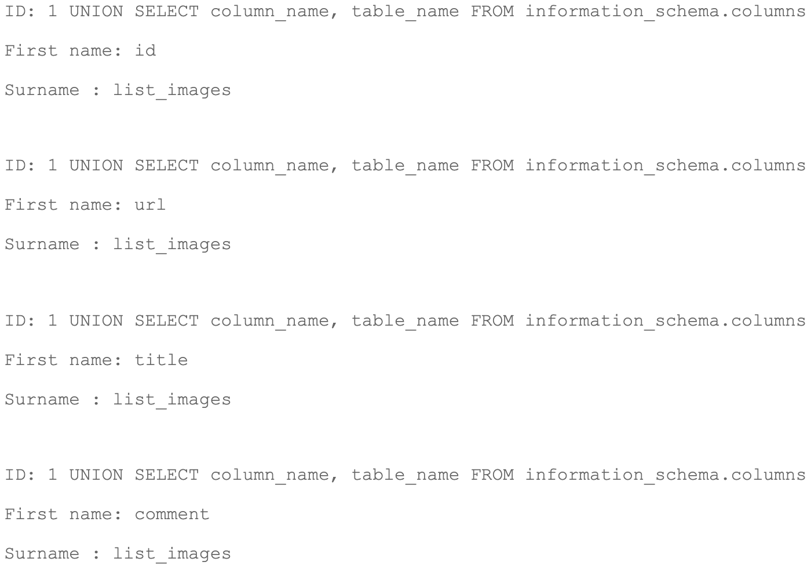
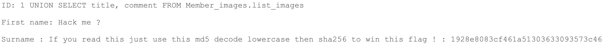

<h1 align="center">
users
</h1>
<p><b> La base de donnée : </b></p>

Sur la page Member, nous pouvons voir un champs qui permet de récupérer le nom et prénom d'un membre en entrant son id.  
En testant un peu (`1 or true`) on peux se rendre compte que la requête est mal faite (surement une requête pas prepare).  
Nous allons donc récupérer les informations de la base de donnée avec `information_schema`.  
Etant donné que nous avons une requête de base qui récupérer 2 informations depuis la base de donnée, nous somme limite à ce même nombre pour nos requêtes, dans le cas contraire nous avons une erreur, exemple :
```
1 UNION SELECT * FROM information_schema.tables
==> 
The used SELECT statements have a different number of columns
```

Nous allons d'abord récupérer les noms des tables ainsi que les types : 
```
1 UNION SELECT table_name, table_type FROM information_schema.tables
```
Nous pouvons constater qu'il y a 5 tables de type "BASE" : `db_default`, `users`, `guestbook`, `list_images`, `vote_dbs`.

<p><b> La base list_images :</b></p>

Nous allons fouiller la base `list_images` afin d'y extraire des informations a notre avantage.
Récuperons d'abord le nom de la base de donnée à laquelle appartient la table `list_images`:


La table `list_images` appartient donc à la base `Member_images`.  
Nous allons ensuite récupérer les noms de colones de la table `list_images` afin de pouvoir faire nos requête suivantes :


La table à donc 4 colones : ``` id, url, title et comment  ```

<p><b> Récuperation du flag :</b></p>

Nous allons recuperer des informations dans cette table


`1928e8083cf461a51303633093573c46` est le md5 de `albatroz`
`albatroz` en sha256 donne `f2a29020ef3132e01dd61df97fd33ec8d7fcd1388cc9601e7db691d17d4d6188`
<p><b> Solutions : </b></p>
Proteger les requetes sql en les préparant.
