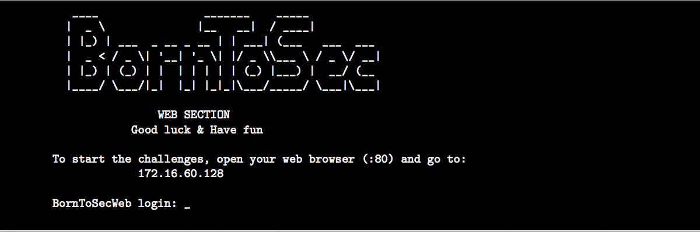

<h1 align="center">
Darkly 
</h1>

<h3 align="center"><b>Description</b></h3>

Projet introductif à la sécurité en informatique dans le domaine spécifique du web, ce projet va vous faire disséquer un site web vulnérable. Ce faisant, vous allez développer votre propre façon de penser sécurité dans une application web et prendre conscience des problèmes liés à de simples erreurs de développement, autant d'un point de vue programmation que d'un point de vue conception.

||<h3 align="center"> Documentation </h3>|
|:--------:|:---------:|
|wget|http://jp.barralis.com/linux-man/man1/wget.1.php   https://stackoverflow.com/questions/273743/using-wget-to-recursively-fetch-a-directory-with-arbitrary-files-in-it|
|La balise object|http://joliclic.free.fr/html/object-tag/|
|Les user-agent|https://betanews.com/2017/03/22/user-agent-based-attacks-are-a-low-key-risk-that-shouldnt-be-overlooked/|
|information_schema|https://mariadb.com/kb/en/information-schema-columns-table/|
|La faille upload|https://openclassrooms.com/fr/courses/2091901-protegez-vous-efficacement-contre-les-failles-web/2680177-la-faille-upload|

----

Credits  <a href="https://github.com/lpieri">lpieri</a>  <a href="https://github.com/leonardogb">lgarcia-</a>  <a href="https://github.com/Drakauf">shthevak</a>
